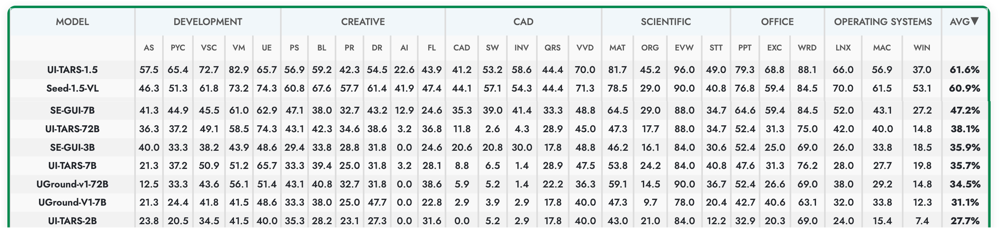

<h1 align="center">Enhancing Visual Grounding for GUI Agents via Self-Evolutionary Reinforcement Learning</h1>

<b>
  <a href="https://github.com/YXB-NKU">Xinbin Yuan</a>, 
  <a href="">Jian Zhang</a>, 
  <a href="">Kaixin Li</a>, 
  <a href="">Zhuoxuan Cai</a>, 
  <a href="">Lujian Yao</a>, 
  <a href="">Jie Chen</a>, 
  <a href="">Enguang Wang</a>, 
  <a href="">Qibin Hou</a>,
  <a href="">Jinwei Chen</a>,
  <a href="">Peng-Tao Jiang</a>,
  <a href="">Bo Li</a>
</b>

设计并实现了一种基于强化学习的 GUI 智能体训练框架，通过高质量种子数据筛选、密集策略梯度反馈及注意力自演化机制显著提升界面元素定位能力。在仅使用 3k 训练样本的条件下，使 7B 参数模型在多个基准任务上达到同量级模型SOTA.
