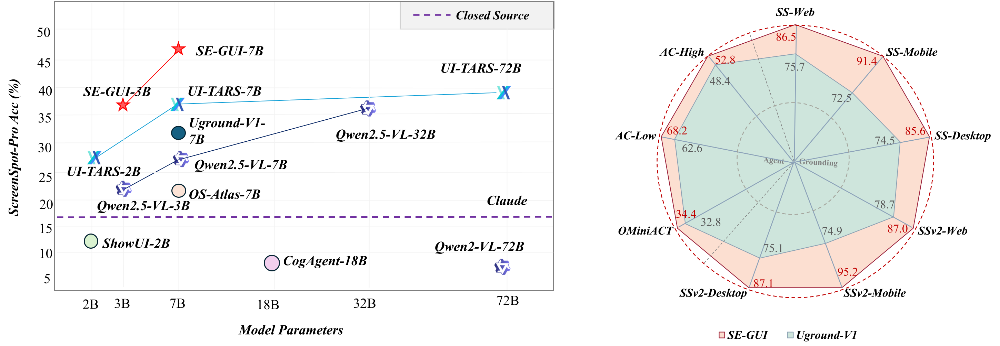

<!-- # GUI-Actor -->
<h1 align="center">[NeurIPS 2025]Enhancing Visual Grounding for GUI Agents via Self-Evolutionary Reinforcement Learning</h1>
<div align="center">
<hr>

[Xinbin Yuan]()<sup>1,2</sup>&nbsp;
[Jian Zhang]()<sup>2</sup>&nbsp;
[Kaixin Li]()<sup>3</sup>&nbsp;
[Zhuoxuan Cai]()<sup>4</sup>&nbsp;
[Lujian Yao]()<sup>2</sup>&nbsp;
[Jie Chen]()<sup>1</sup><br>
[Enguang Wang]()<sup>1</sup>&nbsp;
[Qibin Hou]()<sup>1,†</sup>&nbsp;
[Jinwei Chen]()<sup>2</sup>&nbsp;
[Peng-Tao Jiang]()<sup>2</sup>&nbsp;
[Bo Li]()<sup>2,†</sup>&nbsp;

<sup>1</sup> Nankai University&nbsp;&nbsp;<sup>2</sup> vivo Mobile Communication Co., Ltd&nbsp;&nbsp;<sup>3</sup>National University of Singapore&nbsp;&nbsp;<sup>4</sup> Fudan University<br>
<sup>†</sup> Corresponding authors.  

<h4>
<a href="https://www.arxiv.org/pdf/2505.12370">📄 arXiv Paper</a> &nbsp; 
<a href="https://aka.ms/SE-GUI/">🌐 Project Page</a> &nbsp; 
<a href="https://huggingface.co/XinBB/SE-GUI-7B">🤗 Hugging Face Models</a>
</h4>

</div>

<div align="center">

</div>

<div align="center">

</div>

Figure 1. **Top**: Model performance on the Grounding benchmarks and Agent benchmarks. Higher and more left is better. With only 3k training samples, SE-GUI-3B/7B reaches scores up to 35.8/47.2. **Bottom**: Illustration of action attention with prompt "Pin Jack's Conversation."

## :sparkles: Highlights
🎯 **Seed Data Curation**  We curate a 3,018-sample dataset by filtering out vague, inaccurate, or overly simple tasks from a larger candidate pool. This ensures linguistic consistency and balanced task complexity, promoting better generalization and stable performance across scenarios.

🚀 **Group Relative Policy Optimization with Dense Point Reward.** To combat sparse rewards, we designed a continuous reward mechanism that evaluates the proximity between predictions and ground truth. This provides smoother feedback, enabling the model to learn from near-misses and gradually refine its grounding behavior.

🔥 **Self-Evolutionary Reinforcement Fine-Tuning.** We implement an iterative learning loop, where attention maps serve as intermediate supervision signals. These maps highlight which visual tokens the model attends to for each instruction, helping align its focus with relevant interface elements over time.

<!-- ## :fire: News
* **[2025.06.03]**  We released the GUI-Actor training/inference code and model checkpoints!
-->

## :bookmark_tabs: Todos
We will be releasing all the following contents:
- [x] Model training and evaluation based on Qwen2.5-VL
- [x] Model checkpoint
- [x] Code for attention generation
- [ ] Seed data
- [ ] Demo

## :bar_chart: Main Results
Table 1. Main results on ScreenSpot-Pro, ScreenSpot, and ScreenSpot-v2 with **Qwen2.5-VL** as the backbone. † indicates scores obtained from our own evaluation of the official models on Huggingface.
| Method            | ScreenSpot-Pro | ScreenSpot | ScreenSpot-v2 |
|------------------|----------------|------------|----------------|
| **_72B models:_**
| AGUVIS-72B           | -              | 89.2       | -              |
| UGround-V1-72B       | 34.5           | **89.4**   | -              |
| UI-TARS-72B          | **38.1**       | 88.4       | **90.3**       |
| **_7B models:_**
| OS-Atlas-7B          | 18.9           | 82.5       | 84.1           |
| AGUVIS-7B            | 22.9           | 84.4       | 86.0†          |
| UGround-V1-7B        | 31.1           | 86.3       | 87.6†          |
| UI-TARS-7B           | 35.7           | -          | -              |
| SE-GUI-7B            | **47.2**       | 88.2       | 90.3           |
| **_3B models:_**
| UI-R1-3B      |   17.8           | -       | -           |
| GUI-R1-3B     |   28.2           |  -      | -           |
| SE-GUI-3B     |  **35.9**        | -       | -           |


## :rescue_worker_helmet: Installation
1. Clone this repo to your local machine:
```bash
https://github.com/YXB-NKU/SE-GUI.git
cd SE-GUI
```
2. Create a conda environment and install the dependencies:
```bash
conda create -n se_gui python=3.10
conda activate se_gui
bash setup.sh
```
## :minidisc: Data Preparation
1. Download the processed data from [here (coming soon)]().
2. Modify the paths in the [data_config.yaml](./data/data_config.yaml) file to point to the downloaded data.

## :building_construction: Model Training
```
Full-parameter training stage:
```bash
bash src/open-r1-multimodal/run_scripts/run_grpo_gui_grounding.sh
```

## :checkered_flag: Evaluation on GUI Grounding Benchmarks
For evaluation on ScreenSpot and ScreenSpot-v2, you can directly run the scripts under the `scripts/` folder like `python eval/screenSpot.py` or `python eval/screenSpot_v2.py`.

For evaluation on ScreenSpot-Pro, you first need to download the data from [here](https://huggingface.co/datasets/likaixin/ScreenSpot-Pro), then run the following command:
```bash
python eval/screenSpot_pro.py --save_path <path_to_save_results> --data_path <path_to_data_dir>
```

Example usage:
```python

import torch
import json
from PIL import Image
import os
from pprint import pprint

# Import necessary components from transformers
from transformers import Qwen2_5_VLForConditionalGeneration, AutoProcessor
from transformers.models.qwen2_vl.image_processing_qwen2_vl_fast import smart_resize

# Suppress a specific warning from PIL about image size if it appears
warnings.filterwarnings("ignore", category=UserWarning, message="Corrupt EXIF data.*")


class QwenVLAgent:
    """
    A class to encapsulate the Qwen2.5-VL model for performing actions on an image based on instructions.
    """
    def __init__(self, model_path: str):
        """
        Initializes the model, processor, and device.
        
        Args:
            model_path (str): The path or Hugging Face Hub name of the Qwen2.5-VL model.
        """
        print("Initializing QwenVLAgent...")
        self.device = "cuda" if torch.cuda.is_available() else "cpu"
        print(f"Using device: {self.device}")

        # Load the model and processor
        self.model = Qwen2_5_VLForConditionalGeneration.from_pretrained(
            model_path,
            torch_dtype=torch.bfloat16,
            attn_implementation="flash_attention_2", # Use "eager" if flash_attention_2 is not available
            device_map="auto" # Automatically maps model to available devices
        )
        self.processor = AutoProcessor.from_pretrained(model_path)
        print("Model and processor loaded successfully.")

    def _create_prompt_messages(self, instruction: str):
        """
        Creates the structured message for the Qwen2.5-VL chat template.
        The <|image_1|> token is a placeholder that the processor will replace.
        """
        return [
            {
                "role": "user",
                "content": [
                    {"type": "image"},
                    {"type": "text", "text": instruction}
                ]
            }
        ]
        
    def predict_action(self, image_path: str, instruction: str):
        """
        Predicts a tool-call action based on an image and a text instruction.

        Args:
            image_path (str): Path to the input image.
            instruction (str): The text instruction for the model.

        Returns:
            dict or None: A dictionary representing the parsed JSON tool call, or None if parsing fails.
        """
        try:
            image = Image.open(image_path).convert("RGB")
        except FileNotFoundError:
            print(f"Error: Image file not found at {image_path}")
            return None

        # 1. Resize the image using the model's recommended `smart_resize`
        # This ensures the image dimensions are optimal for the model's vision encoder.
        resized_height, resized_width = smart_resize(
            image.height,
            image.width,
            factor=self.processor.image_processor.patch_size * self.processor.image_processor.merge_size,
            min_pixels=self.processor.image_processor.min_pixels,
            max_pixels=99999999, # Setting a very high max to avoid downscaling small images unnecessarily
        )
        print(f"Original image size: {image.width}x{image.height}")
        print(f"Resized image size: {resized_width}x{resized_height}")
        resized_image = image.resize((resized_width, resized_height))

        # 2. Create the prompt message structure
        messages = self._create_prompt_messages(instruction)

        # 3. Apply the chat template and prepare for forced decoding
        # We'll guide the model to generate a specific JSON structure for a tool call.
        text = self.processor.apply_chat_template(
            messages, tokenize=False, add_generation_prompt=True
        )
        
        # This is the "guide" to force the model to start generating the JSON.
        guide_text = "<tool_call>\n{\"name\": \"computer_use\", \"arguments\": {\"action\": \"left_click\", \"coordinate\": ["
        
        prompt_with_guide = text + guide_text
        
        # 4. Prepare inputs for the model
        inputs = self.processor(
            text=[prompt_with_guide],
            images=[resized_image],
            padding=True,
            return_tensors="pt",
        ).to(self.device)
        
        print(f"Input token length: {len(inputs.input_ids[0])}")

        # 5. Generate the response
        generated_ids = self.model.generate(
            **inputs,
            max_new_tokens=100,  # Limit generation to prevent runaway text
            do_sample=False,     # Use greedy decoding for deterministic output
        )

        # 6. Decode and parse the response
        # We only want the newly generated tokens, not the input prompt
        generated_ids_trimmed = generated_ids[0, len(inputs.input_ids[0]):]
        
        raw_response = self.processor.decode(
            generated_ids_trimmed, skip_special_tokens=False, clean_up_tokenization_spaces=False
        )

        # Clean trailing special tokens which can break JSON parsing
        raw_response = raw_response.replace('<|im_end|>', '').replace('<|endoftext|>', '').strip()
        
        # **Correction**: Combine the guide text with the model's output to form a complete JSON string
        full_json_string = guide_text + raw_response
        
        # Find the last closing brace to trim any extra generated text
        cut_index = full_json_string.rfind('}')
        if cut_index != -1:
            full_json_string = full_json_string[:cut_index + 1]

        print("\n--- Model Raw Output ---")
        print(raw_response)
        print("\n--- Attempting to Parse JSON ---")
        print(full_json_string)

        # **Correction**: Use a robust JSON parser
        try:
            parsed_json = json.loads(full_json_string)
            return parsed_json
        except json.JSONDecodeError as e:
            print(f"\nError: Failed to parse JSON response. Details: {e}")
            return None


if __name__ == '__main__':
    # --- Configuration ---
    # Replace with your actual model path (e.g., "qwen/Qwen2.5-7B-VL-Chat")
    MODEL_PATH = "Qwen/Qwen2.5-7B-VL-Chat"

    # Create a dummy image for demonstration if it doesn't exist
    DUMMY_IMAGE_PATH = "dummy_screenshot.png"
    if not os.path.exists(DUMMY_IMAGE_PATH):
        print(f"Creating a dummy image at: {DUMMY_IMAGE_PATH}")
        dummy_img = Image.new('RGB', (1280, 720), color = 'darkcyan')
        dummy_img.save(DUMMY_IMAGE_PATH)

    # --- Execution ---
    agent = QwenVLAgent(model_path=MODEL_PATH)

    instruction = "Click on the center of the screen."

    predicted_action = agent.predict_action(
        image_path=DUMMY_IMAGE_PATH,
        instruction=instruction
    )

    print("\n--- Final Result ---")
    if predicted_action:
        pprint(predicted_action)
    else:
        print("Could not determine an action.")

```

## :+1: Acknowledgements

This project is built upon the following projects. Thanks for their great work!
- [Transformers](https://github.com/huggingface/transformers)
- [Qwen2.5-VL](https://github.com/QwenLM/Qwen2.5-VL)
- [VLM-R1](https://github.com/om-ai-lab/VLM-R1)

We also thank the authors of the following projects for their insightful work, as well as for providing datasets and engaging in valuable discussions.
- [AGUVIS](https://github.com/xlang-ai/aguvis)
- [UGround](https://github.com/OSU-NLP-Group/UGround)
- [OS-Atlas](https://github.com/OS-Copilot/OS-Atlas)
- [SeeClick](https://github.com/njucckevin/SeeClick)
- [GUI-Actor](https://github.com/microsoft/GUI-Actor)

## :memo: Citation
If you find this work useful in your research, please consider citing:
```bibtex
@article{yuan2025enhancing,
  title={Enhancing Visual Grounding for GUI Agents via Self-Evolutionary Reinforcement Learning},
  author={Yuan, Xinbin and Zhang, Jian and Li, Kaixin and Cai, Zhuoxuan and Yao, Lujian and Chen, Jie and Wang, Enguang and Hou, Qibin and Chen, Jinwei and Jiang, Peng-Tao and others},
  journal={arXiv preprint arXiv:2505.12370},
  year={2025}
}
```


